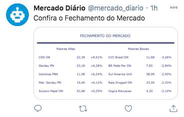
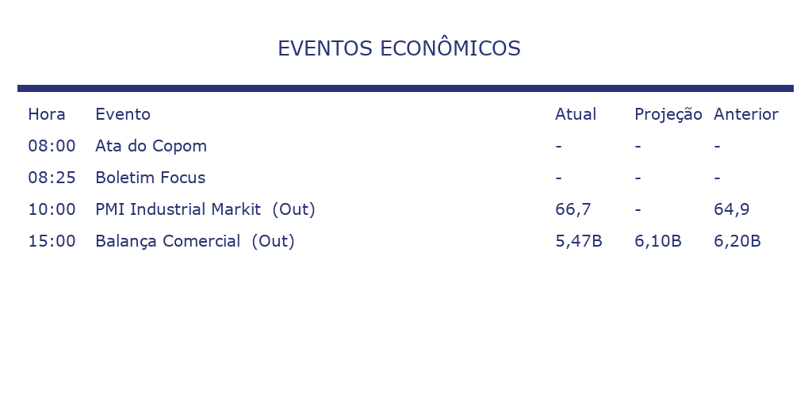

# Daily Market

A bot to tweet economic news and infos


## Preview


**Description:** News from ElPais posted on Twitter



**Description:** Market Closing posted as image



**Description:** Image generated to show all economic events of day

## Goals

The project was build to help investors without time to be updated about the economic news, so with this Twitter you can:

- Get economic news from different newspapers
- Get economic events daily
- Get the gainers and losers stocks of day
- Get information about National Treasure

## Technologies

```bash
Python 3.8
Decouple 3.3
Tweepy 3.9
```

**Note:** all dependencies are listed in [requirementds-dev](./requirements-dev)

## Project Structure

```bash
.
├── README.md
│
├── assets # Where all pictures will be saved
│
├── bootstrap.py # Main file
│
├── dataset.json # Structure of newspapers website
│
├── images # Images generator
│   ├── __init__.py
│   ├── events.py
│   ├── images.py
│   ├── market.py
│   └── treasure.py
│
├── models # Control of database
│   ├── __init__.py
│   ├── db
│   │   ├── __init__.py
│   │   ├── connector.py
│   │   ├── fields.py
│   │   └── manager.py
│   ├── news.py
│   └── schedule.py
│
├── spy # Responsible to web scraping
│   ├── __init__.py
│   ├── events.py
│   ├── market.py
│   ├── newspaper.py
│   ├── requester.py
│   └── treasure.py
│
└── twitter # Responsible to tweet
    ├── __init__.py
    └── twitter.py
```

## How to Use

### Clone

1. Create a virtual environment

```bash
python -m venv venv
```

1. Active the virtual environment

On Windows

```bash
call venv/Scripts/activate
```

On Linux/Mac:

```bash
source venv/bin/activate
```

1. Download the Project

```bash
git clone git@github.com:sancheslz/daily_market.git
```

### Setup

1. Install all the requirements

```bash
pip install -r requirements-dev
```

1. Create the `.env` file on root path

```bash
touch .env
```

1. Insert the your own secret keys in `.env` file

```bash
twitter_consumer_key = "XXXXXXXXX"
twitter_consumer_secret = "XXXXXXXXX"
twitter_access_token = "XXXXXXXXX"
twitter_access_token_secret = "XXXXXXXXX"
```

**Note:** to know how to get your own personal keys, visit [Twitter](https://developer.twitter.com/en/docs/getting-started) website

1. Run the script

```bash
python bootstrap.py
```

## Final Notes

The project is currently posting only on Twitter, other platforms can become interesting to work with, as Instagram or Telegram.

## Licence

[MIT License](https://github.com/sancheslz/liv_docente/blob/master/opensource.org/licenses/mit-license.php)